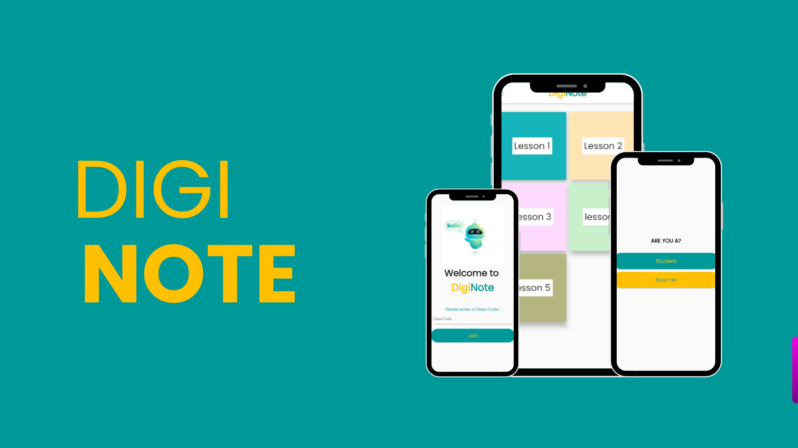

# 🧪 Projects

## **DIGINOTE**🔗

Developer | Freelance

    
  
  
- a note-taking app that seamlessly integrates question submission and viewing capabilities.

  
<strong>TECH STACK USED:</strong>

  <ul>
    <li>Flutter</li>
    <li>Dart</li>
    <li>Firebase</li>
    <li>Django REST API</li>
  </ul>

## **PICK-IT**🔗

Developer | Freelance

  
  
  
  

- an interactive Web-based Game in which users can learn and classify rocks and minerals based on their varied characteristics.

<strong>TECH STACK USED:</strong>

<ul>
  <li>Phaser 3</li>
  <li>Typescript</li>
  <li>Vite.js</li>
  <li>Supabase</li>
</ul>

## **EVA**🔗

Developer | Freelance

  
  
- a Web-Based Employee evaluation platform designed toenhance the employee evaluation process within organizations.

<strong>TECH STACK USED:</strong>

<ul>
  <li>Django Web Framework</li>
  <li>Python</li>
</ul>

## **SUPER ADMIN APP** 🔗

Developer | Contract at <a href="https://wela.online/en/">WELA School Systems</a>

  
  

- Super Admin App provides administrators direct access to important school statistics for faster and more convenient community management.

<strong>TECH STACK USED:</strong>

<ul>
  <li>Flutter</li>
  <li>Dart</li>
  <li>Frappe</li>
  <li>Python</li>
  <li>Firebase</li>
</ul>

## **WELA PARENT APP**🔗

Developer | Contract at <a href="https://wela.online/en/">WELA School Systems</a>

  
  
  

- A parent monitoring app that tracks students' performance and information.

<ul>
  <li>Flutter GetX</li>
  <li>Dart</li>
  <li>Frappe</li>
  <li>Python</li>
  <li>Firebase</li>
  <li>Fastlane</li>
</ul>